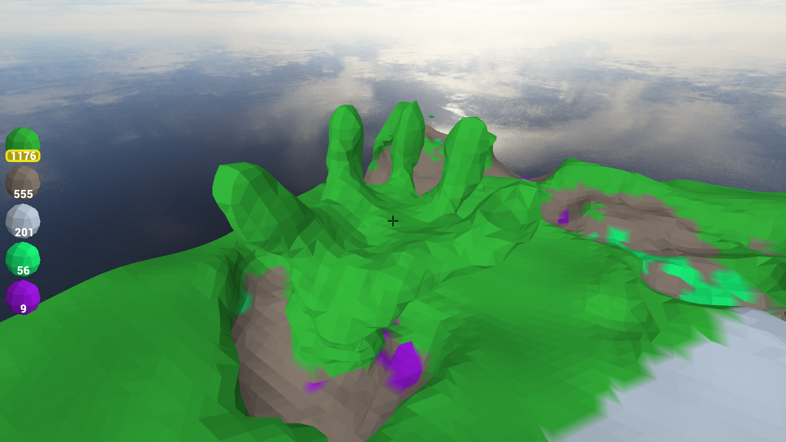
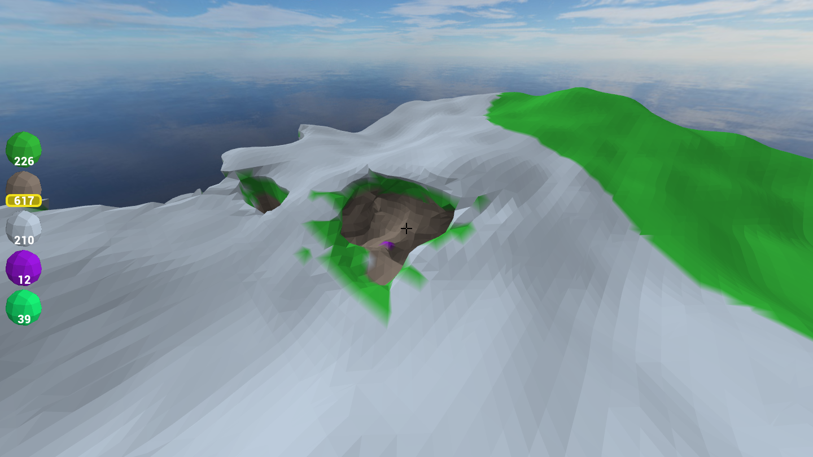

# Dynamic Terrain using Marching Cubes
This was done as a project for the course [TSKB07](http://computer-graphics.se/TSBK07/) at Linköping University. The project is an implementation of dynamic terrain using marching cubes. 

## Dependencies 
To run the project a OpenGL shader version of 4.5 is required. If this version is not met, nothing will be shown on screen and error messages will be printed. 
### Ubuntu
Not entirely sure if these work anymore, was a long time since I used Ubuntu. But it atleast gives some hint of what is required.
```
  sudo add-apt-repository ppa:glasen/freetype2
  sudo apt update
  sudo apt install freetype2-demos libfreeimage3 libfreeimage-dev xorg-dev libglew-dev libglfw3-dev
```

### Manjaro 
```
  pamac install freeimage freetype2 glew glfw-x11
```

## Running
To compile and run the application you need to also download my [engine](https://github.com/Thraix/Greet-Engine-Port) (verified to work on engine commit `26da0106fa6172faa74c5ccb562ee654d8656f1c`) and place it in the same directory as this project (ie `~/Documents/TIMber` and `~/Documents/Greet-Engine-Port`) then if you use [MakeGen](https://github.com/Thraix/MakeGen) simply run
```
makegen run
```
in the `TIMber` directory to run the program.

Otherwise, you first need to build the engine inside `Greet-Engine-Port/Greet-core` by running
```
make
```
then compiling and running the project with
```
make run
```
in the `TIMber` directory.

## Using the raytracer
The controls for the game is pretty straight forward. Move player with WASD, move up and down with space and shift. Move the camera with the mouse. To change which material you are placing down scroll the mouse wheel. To place out voxels in the terrain hold down the right mouse button when aiming on the terrain (this will only work within 20 units or when a striped sphere appears on the terrain). To remove voxels hold down the left mouse button.

In order to toggle the grabbing of the mouse simply press escape.

## Screenshots
### Sculpting 


### Caves 

